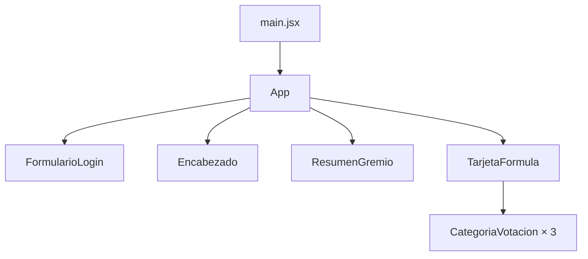

# Potion Lab — V.1.0.

Primera versión académica del proyecto semestral. Cubre un flujo pequeño pero
completo: iniciar sesión, consultar un gremio, abrir una fórmula y votar una vez
en cada una de sus tres categorías.

## Ejecutar el proyecto entregado

Requisito: Node.js 20.19+ o 22.12+.

```bash
cd potion-lab
npm install
npm run dev
```

Vite mostrará una dirección local, normalmente `http://localhost:5173`.

Cuenta de prueba:

- Correo: `simon@potionlab.edu`
- Contraseña: `pocion123`

No uses una contraseña real: esta autenticación solo existe en el navegador.

## Crear la base desde cero con Vite

```bash
npm create vite@latest potion-lab -- --template react
cd potion-lab
npm install
npm run dev
```

Después se reemplazan los archivos de ejemplo de Vite por los incluidos en esta
entrega.

## Qué funciona

- Login y logout de una cuenta demo.
- Perfil con nombre y especialidad alquímica.
- Visualización de un gremio y sus miembros.
- Una fórmula en estado `VotingOpen`.
- Tres categorías con exactamente dos opciones cada una.
- Un voto por categoría.
- Cambio de voto mediante sustitución de la selección anterior.
- Recuento y porcentaje actualizados inmediatamente.
- Interfaz responsive para escritorio y móvil.

## Relación entre componentes



`App` conserva el estado compartido. Los componentes hijos reciben datos y
funciones mediante props. `CategoriaVotacion` se reutiliza tres veces, una por
categoría.

## Estructura importante

```text
src/
├── components/
│   ├── auth/FormularioLogin.jsx
│   ├── formula/CategoriaVotacion.jsx
│   ├── formula/TarjetaFormula.jsx
│   ├── gremio/ResumenGremio.jsx
│   └── layout/Encabezado.jsx
├── data/datosDemo.js
├── utils/votacion.js
├── App.jsx
├── App.css
├── index.css
└── main.jsx
```

## Conceptos de React de esta sesión

- **JSX:** permite describir la interfaz usando una sintaxis parecida a HTML
  dentro de JavaScript.
- **Componentes:** separan la página en piezas pequeñas con una responsabilidad.
- **Props:** llevan datos o funciones del componente padre al hijo.
- **`useState`:** conserva el usuario, el formulario, los errores y los votos
  entre renderizados.
- **Eventos:** `onChange`, `onSubmit` y `onClick` conectan acciones del
  usuario con funciones.
- **Renderizado condicional:** `App` decide entre login y tablero según exista
  un usuario activo.
- **Renderizado de listas:** `map` crea miembros, categorías y opciones; cada
  elemento recibe una `key` estable.
- **Estado inmutable:** el spread `...` crea un objeto nuevo al cambiar un voto.
- **Elevar el estado:** los votos viven en `App` porque los necesitan tanto el
  encabezado como la tarjeta de fórmula.
- **Datos derivados:** conteos y porcentajes se calculan desde el estado existente
  en vez de duplicarse en otro `useState`.

## Simplificaciones intencionales

Esta no es todavía una autenticación segura. No hay servidor, base de datos,
sesiones reales ni cifrado. Los datos están sembrados en `datosDemo.js` y se
reinician al recargar la página. Tampoco se aplican todavía pesos por
especialidad, voto doble, fechas automáticas ni transiciones de estado.

Mantener esas partes fuera permite estudiar primero el flujo esencial de React
sin mezclarlo con APIs, seguridad, backend y reglas de negocio avanzadas.

## Roadmap pendiente

1. Registro editable y persistencia local con `useEffect` y `localStorage`.
2. Creación y unión a gremios públicos/privados, códigos y administración de
   roles.
3. Creación de fórmulas y máquina de estados
   `Proposal → VotingOpen → Closed → Distilled`.
4. Fechas de cierre, autorización y cierre automático/manual.
5. Pesos por especialidad, Catador Oficial, voto doble, veto y desempates.
6. Destilación, cálculo de dificultad/rareza y Grimoire.
7. Rankings, penalizaciones, búsqueda, datos semilla completos y auditoría.
8. Backend, base de datos, autenticación real y actualizaciones en tiempo real.

## Comandos de comprobación

```bash
npm run lint
npm run build
npm run preview
```
